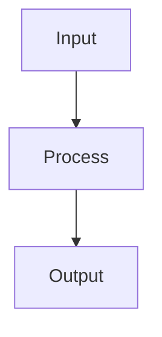
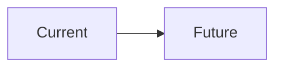
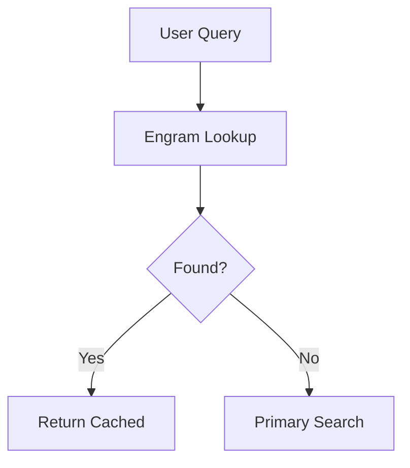

# Documentation Policy & Standards

**Effective:** 2026-03-21  
**Version:** 1.0  
**Applies to:** All Bolt Memory documentation

---

## 📋 Purpose

This document establishes standards for creating, organizing, and maintaining documentation in the Bolt Memory project.

**Goal:** Make documentation as frictionless as the code it describes.

---

## 🏛️ Documentation Hierarchy

```
bolt-memory/
├── README.md                      # Entry point (30-second overview)
├── CHANGELOG.md                   # Version history
├── CONTRIBUTING.md                # Contribution guide
├── CODE_OF_CONDUCT.md             # Community standards
│
├── docs/                          # User-facing documentation
│   ├── INDEX.md                   # Navigation hub
│   ├── user-guide/                # How-to guides
│   │   ├── quick-start.md         # 5-minute setup
│   │   ├── installation.md        # Detailed install
│   │   ├── qwen-integration.md    # Qwen Code setup
│   │   ├── mcp-setup.md           # MCP configuration
│   │   ├── cli-commands.md        # CLI reference
│   │   ├── search-examples.md     # Query patterns
│   │   ├── configuration.md       # Settings guide
│   │   ├── troubleshooting.md     # Common issues
│   │   ├── faq.md                 # FAQs
│   │   └── best-practices.md      # Usage tips
│   │
│   ├── api-reference/             # API documentation
│   │   ├── API.md                 # Complete API ref
│   │   ├── endpoints.md           # HTTP endpoints
│   │   ├── schemas.md             # Data schemas
│   │   └── errors.md              # Error codes
│   │
│   ├── architecture/              # Technical architecture
│   │   ├── overview.md            # System design
│   │   ├── star-algorithm.md      # STAR algorithm
│   │   ├── physics-tag-walker.md  # Graph traversal
│   │   ├── radial-distillation.md # Knowledge compression
│   │   ├── mirror-protocol.md     # File reflection
│   │   └── standards/             # Active standards
│   │       ├── standard-132.md    # Search Content Return
│   │       ├── standard-133.md    # Startup Banner
│   │       ├── standard-134.md    # Settings Unity
│   │       ├── standard-135.md    # Watchdog Auto-Enable
│   │       └── standard-136.md    # Streaming Search
│   │
│   ├── development/               # Developer docs
│   │   ├── setup.md               # Local dev environment
│   │   ├── testing.md             # Testing framework
│   │   ├── code-patterns.md       # Coding standards
│   │   └── architecture.md        # Code architecture
│   │
│   ├── integrations/              # Third-party integrations
│   │   ├── mcp-server.md          # MCP integration
│   │   ├── qwen-code.md           # Qwen Code
│   │   ├── claude-desktop.md      # Claude Desktop
│   │   ├── cursor.md              # Cursor IDE
│   │   └── continue.md            # Continue.dev
│   │
│   └── project/                   # Project management
│       ├── status.md              # Current status
│       ├── roadmap.md             # Future plans
│       ├── performance.md         # Benchmarks
│       ├── security.md            # Security audit
│       └── history.md             # Project history
│
├── specs/                         # Technical specifications
│   ├── spec.md                    # System specification
│   ├── plan.md                    # Project roadmap
│   ├── tasks.md                   # Task tracking
│   ├── current-standards/         # Active standards (001-010)
│   │   ├── standard-001.md        # Atomic Decomposition
│   │   ├── standard-002.md        # Tag Derivation
│   │   └── ...
│   └── archive-standards/         # Historical standards
│       └── history/               # Archived standards (059-136+)
│
└── [ROOT-LEVEL-DOCS].md           # Cross-cutting concerns
    ├── FRICTIONLESS_SPEC.md       # Future improvements
    ├── PAIN_POINTS_DOCUMENTATION.md # Known issues
    └── RECURSIVE_SEARCH_FALLBACKS.md # Search strategy
```

---

## 📝 Document Types

### **1. README.md (Entry Point)**
**Purpose:** 30-second overview, immediate value proposition  
**Audience:** Everyone  
**Length:** < 500 lines  
**Structure:**
- Quick start (3 commands max)
- What is this?
- Key features table
- Installation
- Configuration (minimal)
- CLI commands
- Documentation links
- Troubleshooting highlights
- Changelog excerpt
- License

**Example:** [README.md](../README.md)

---

### **2. User Guide (How-To)**
**Purpose:** Task-oriented instructions  
**Audience:** End users  
**Length:** 50-200 lines  
**Structure:**
- Prerequisites
- Step-by-step instructions
- Expected output at each step
- Troubleshooting tips
- Next steps

**Template:**
```markdown
# Task Name

**Purpose:** What this accomplishes

## Prerequisites
- [ ] Requirement 1
- [ ] Requirement 2

## Steps

### Step 1: Do the thing
```bash
command to run
```

**Expected output:**
```
what you should see
```

### Step 2: Next thing
...

## Troubleshooting
- **Problem:** X → **Solution:** Y
- **Problem:** A → **Solution:** B

## Next Steps
- [Related task 1](link)
- [Related task 2](link)
```

---

### **3. API Reference**
**Purpose:** Complete API documentation  
**Audience:** Developers  
**Length:** As needed  
**Structure:**
- Endpoint URL
- HTTP method
- Authentication required
- Request schema
- Response schema
- Error codes
- Examples

**Template:**
```markdown
## POST /v1/memory/search

**Authentication:** Required (Bearer token)

**Request:**
```json
{
  "query": "string (required)",
  "max_results": "number (optional, default: 20)",
  "strategy": "string (optional): standard | max-recall"
}
```

**Response (200 OK):**
```json
{
  "metadata": {
    "totalResults": "number",
    "durationMs": "number"
  },
  "results": [
    {
      "uuid": "string",
      "content": "string",
      "score": "number"
    }
  ]
}
```

**Errors:**
| Code | Message | Meaning |
|------|---------|---------|
| 400 | Query required | Missing query field |
| 401 | Unauthorized | Invalid API key |
| 429 | Rate limited | Too many requests |

**Example:**
```bash
curl -X POST http://localhost:3161/v1/memory/search \
  -H "Authorization: Bearer secret" \
  -d '{"query": "android build"}'
```
```

---

### **4. Architecture Document**
**Purpose:** System design explanation  
**Audience:** Developers, researchers  
**Length:** 100-500 lines  
**Structure:**
- Overview
- Diagrams (Mermaid or ASCII)
- Components
- Data flow
- Algorithms
- Trade-offs

**Template:**
```markdown
# Component Name

## Overview
One-paragraph description

## Architecture



## Components

### Component A
- **Purpose:** What it does
- **Input:** What it receives
- **Output:** What it produces
- **Algorithm:** How it works

### Component B
...

## Data Flow
1. Step 1
2. Step 2
3. Step 3

## Trade-offs
- **Decision:** X
- **Rationale:** Why X over Y
- **Consequences:** What this enables/prevents

## References
- [Related doc 1](link)
- [Related doc 2](link)
```

---

### **5. Standard**
**Purpose:** Formal specification of behavior  
**Audience:** Developers, implementers  
**Length:** 50-300 lines  
**Structure:**
- Standard number and title
- Purpose
- Specification
- Examples
- Compliance requirements
- History

**Template:**
```markdown
# Standard ###: Title

**Effective:** YYYY-MM-DD  
**Status:** Active | Deprecated | Archived

## Purpose
Why this standard exists

## Specification

### Requirement 1
SHALL/MUST language

### Requirement 2
SHALL/MUST language

## Examples

### Example 1: Common case
```json
{
  "example": "code"
}
```

### Example 2: Edge case
...

## Compliance
- [ ] Implementation X compliant
- [ ] Implementation Y compliant

## History
- **v1.0** (YYYY-MM-DD): Initial release
- **v1.1** (YYYY-MM-DD): Clarification
```

---

### **6. Specification (Spec)**
**Purpose:** Future design, conceptual framework  
**Audience:** Developers, stakeholders  
**Length:** 200-1000 lines  
**Structure:**
- Vision
- Diagrams
- Requirements
- Implementation plan
- Timeline

**Template:**
```markdown
# Specification: Feature Name

**Version:** 1.0  
**Status:** Draft | Approved | In Progress | Complete

## Vision
What we're building and why

## Architecture



## Requirements

### Functional
- [ ] Requirement 1
- [ ] Requirement 2

### Non-Functional
- [ ] Performance: < 100ms
- [ ] Reliability: 99.9% uptime

## Implementation Plan

### Phase 1: Foundation
- Task 1
- Task 2
- Timeline: 2 weeks

### Phase 2: Features
...

## Timeline
- **Phase 1:** Week 1-2
- **Phase 2:** Week 3-4
- **Release:** Week 5

## Open Questions
- Question 1
- Question 2

## References
- [Related spec](link)
- [Research](link)
```

---

## ✍️ Writing Standards

### **Tone & Style**
- **Concise:** No filler words
- **Direct:** Active voice, imperative mood
- **Inclusive:** Gender-neutral, accessible language
- **Technical:** Precise terminology, defined on first use

### **Formatting**
- **Headers:** H1 for title, H2 for sections, H3 for subsections
- **Lists:** Use `-` for unordered, `1.` for ordered
- **Code:** Fenced blocks with language specifier
- **Links:** Descriptive text, not "click here"
- **Tables:** Use for comparisons, not layout

### **Examples**
- **Good:** "Run `anchor start` to start the engine"
- **Bad:** "The engine can be started by running the command"

- **Good:** "Search returns results in < 300ms"
- **Bad:** "The search functionality typically provides results relatively quickly"

### **Diagrams**
- **Mermaid:** For flowcharts, sequence diagrams
- **ASCII:** For simple architecture diagrams
- **Images:** Only when necessary (hard to maintain)

**Mermaid Example:**


**ASCII Example:**
```
┌─────────────┐
│   Query     │
└──────┬──────┘
       │
       ▼
┌─────────────┐
│   Engram    │
└──────┬──────┘
       │
       ▼
```

---

## 📅 Maintenance Standards

### **Review Cycle**
- **README.md:** Every release
- **User Guides:** Every major feature
- **API Reference:** Every API change
- **Architecture:** Every 6 months
- **Standards:** When implemented/changed

### **Deprecation Policy**
1. Mark as **Deprecated** with date
2. Add migration guide
3. Wait 2 releases
4. Move to archive
5. Delete after 1 year

### **Versioning**
- **Major:** Breaking changes (v1 → v2)
- **Minor:** New features (v1.1 → v1.2)
- **Patch:** Bug fixes, docs updates (v1.1.0 → v1.1.1)

### **Changelog Entries**
```markdown
### [Version] (YYYY-MM-DD)

#### Added
- Feature X (#123)
- Feature Y (#456)

#### Changed
- Behavior Z (#789)

#### Fixed
- Bug A (#101)
- Bug B (#102)

#### Deprecated
- Feature Q (will be removed in v5.0)

#### Removed
- Old feature R
```

---

## 🗂️ File Naming Standards

### **Format:** `lowercase-with-hyphens.md`

**Good:**
- `quick-start.md`
- `troubleshooting-guide.md`
- `api-reference.md`

**Bad:**
- `QuickStart.md`
- `troubleshooting_guide.md`
- `APIReference.md`

### **Exceptions**
- `README.md` (always uppercase)
- `CHANGELOG.md` (always uppercase)
- `CONTRIBUTING.md` (always uppercase)
- `CODE_OF_CONDUCT.md` (always uppercase)
- `INDEX.md` (navigation hubs)

---

## 🔗 Link Standards

### **Internal Links**
- **Relative:** `user-guide/quick-start.md`
- **From root:** `../README.md`
- **Anchors:** `troubleshooting.md#common-issues`

### **External Links**
- **Full URL:** `https://github.com/RSBalchII/anchor-engine-node`
- **Descriptive text:** [Anchor Engine Repository](https://...)
- **Not:** "click here"

### **Link Checking**
- Run `find . -name "*.md" -exec grep -l "http" {} \;` monthly
- Fix broken links within 1 week of report

---

## 📊 Quality Metrics

### **Documentation Coverage**
- [ ] README.md exists and is < 6 months old
- [ ] Every feature has user guide
- [ ] Every API endpoint documented
- [ ] Every config option explained
- [ ] Troubleshooting covers top 10 issues

### **Readability**
- [ ] Flesch-Kincaid grade level < 10
- [ ] No sentences > 40 words
- [ ] Passive voice < 10%
- [ ] Jargon defined on first use

### **Maintainability**
- [ ] No orphaned documents (unlinked)
- [ ] No circular references
- [ ] All diagrams render
- [ ] All code examples tested

---

## 🎯 Documentation by Audience

| Audience | Documents | Tone | Detail |
|----------|-----------|------|--------|
| **New Users** | README, quick-start, installation | Welcoming | Minimal |
| **End Users** | user-guide/*, troubleshooting | Helpful | Task-focused |
| **Developers** | api-reference/*, development/* | Technical | Complete |
| **Researchers** | whitepaper.md, architecture/* | Academic | Rigorous |
| **DevOps** | DEPLOYMENT.md, guides/* | Precise | Operational |

---

## 📝 Template Files

Templates are available in `docs/templates/`:
- `user-guide-template.md`
- `api-reference-template.md`
- `architecture-template.md`
- `standard-template.md`
- `spec-template.md`

---

## ✅ Compliance Checklist

Before merging documentation:

- [ ] Follows file naming standard
- [ ] Uses correct header hierarchy
- [ ] Includes "Last Updated" date
- [ ] All links work
- [ ] Code examples tested
- [ ] Diagrams render correctly
- [ ] Spelling/grammar checked
- [ ] Cross-references updated
- [ ] Added to INDEX.md navigation
- [ ] Changelog updated (if applicable)

---

**Last Updated:** 2026-03-21  
**Maintainer:** @rbalchii  
**Next Review:** 2026-06-21
